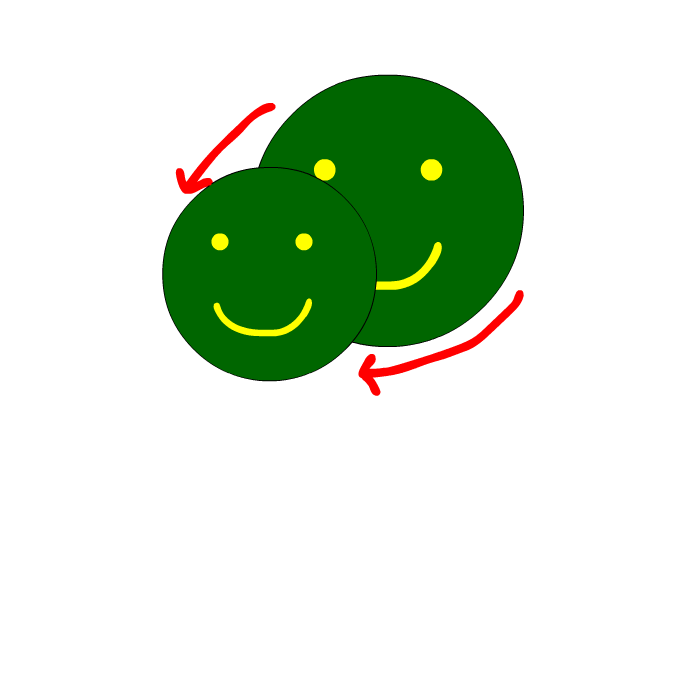
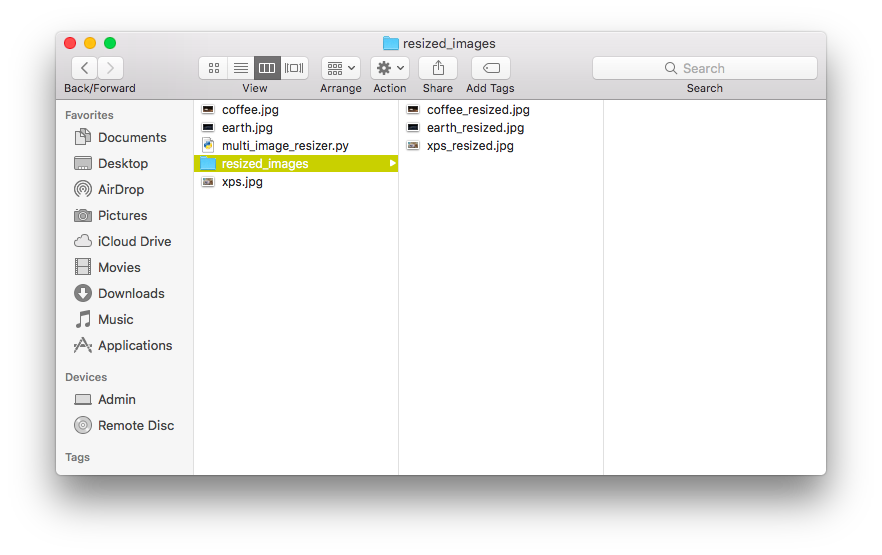

<!--
***Thank you for checking out my project. I am open to any suggestions for improvement.
***Please fork the repository and create a pull request or open an issue with the
***tag "improvement".
-->

# Multi-Image Resizer

<br />
<p align="center">
  <a href="https://github.com/reoyamanaka/multi-image-resizer.git">
    
  </a>

  <h3 align="center">Multi-Image Resizer</h3>

  <p align="center">
    A Python program that enables multi-image resizing for Intersection Observer API complementation.
    <br />
    <a href="https://github.com/reoyamanaka/multi-image-resizer.git"><strong>Explore the docs »</strong></a>
    <br />
    <br />
    <a href="https://youtu.be/povSKujVa9A">View Demo</a>
    .
    <a href="https://github.com/reoyamanaka/multi-image-resizer/issues">Report Bug</a>
  </p>
</p>

<!-- Table of Contents -->

* [About the Project](#about-the-project)
  * [Built with](#built-with)
* [Getting Started](#getting-started)
  * [Prerequisites](#prerequisites)
  * [Installation](#installation)
* [Usage](#usage)
* [Contributing](#contributing)
* [License](#license)

## About The Project
<p align="center">
  
</p>

### Built With

* Python 3.8.1
* IDLE 3.8.1
* macOS High Sierra Version 10.13.6
* Adobe Illustrator Version 23.1 (Logo design)

## Getting Started

To get a local copy up and running follow these simple steps.

### Prerequisites

* Pillow
```sh
pip install Pillow==2.2.2
```
* glob
```sh
pip3 install glob3
```
* natsort
```sh
pip install natsort
```

### Installation

1. Clone the repository
```sh
git clone https://github.com/reoyamanaka/multi-image-resizer.git
```
2. Install Pillow module
```sh
pip install Pillow==2.2.2
```
3. Install glob module
```sh
pip3 install glob3
```
4. Install natsort module
```sh
pip install natsort
```

## Usage

<div align="center">
  <strong>YouTube Demo</strong><br>
  <a href="https://youtu.be/povSKujVa9A">
    
  </a>
</div>

## Contributing

I would greatly appreciate any contributions.

1. Fork the Project
2. Create your Feature Branch (`git checkout -b feature/CoolFeature`)
3. Commit your Changes (`git commit -m 'Added some CoolFeature'`)
4. Push to the Branch (`git push origin feature/CoolFeature`)
5. Open a Pull Request


## License

Distributed under the GNU Affero General Public License v3.0 License. See `LICENSE` for more information.

## Contact

Reo Yamanaka - [LinkedIn](https://www.linkedin.com/in/reo-yamanaka-7a2289119/) - [My YouTube channel](https://www.youtube.com/channel/UCBwqp_MEM2XcSnq7kRvOB3A) - ryamanaka807@gmail.com

Project Link: [https://github.com/reoyamanaka/multi-image-resizer.git](https://github.com/reoyamanaka/multi-image-resizer)
